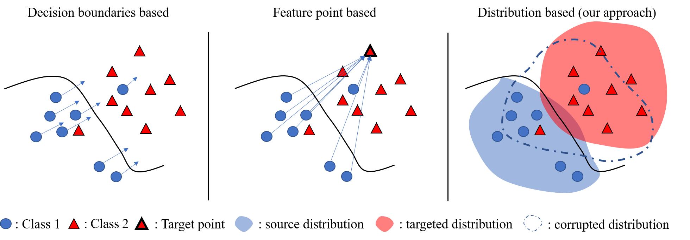

# MD-APA

This repository contains the code for the paper "Matching distribution adversarial patch attack for better-attacking generalization" submitted to 37th Conference on Neural Information Processing Systems (NeurIPS 2023).

<p>

</p>

### Environment Installation:
First, you may prefer to create a virtual environment by running for example with conda: 

`conda create -n myenv python==3.9`

Then, activate the envionment by running:

`conda activate myenv`

Now you can install the requirments packages by running:

`pip install -r requirements.txt`

### Scripts

First you have to download the quantiles here:

https://zenodo.org/record/7945025

The following script trains a patch for a chosen category and for a chosen source model (Swin T/S/B). 

```python quantiles_ot.py ```  
